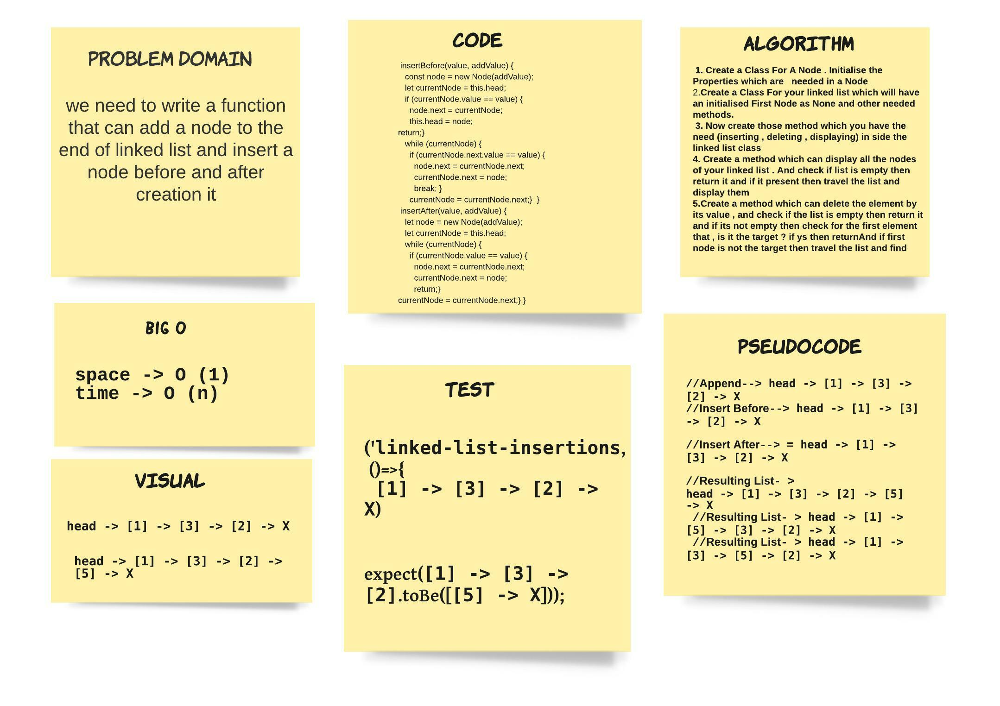
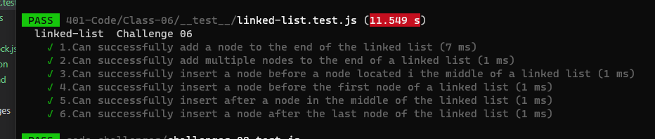

# linked-list-insertions

> we need to write a function that can add a node to the end of linked list and insert a node before and after creation it 

## Whiteboard Process

## Approach & Efficiency
> - 1.5 hours 
- the space that the size of the array 
- the time of finding the wanted value

