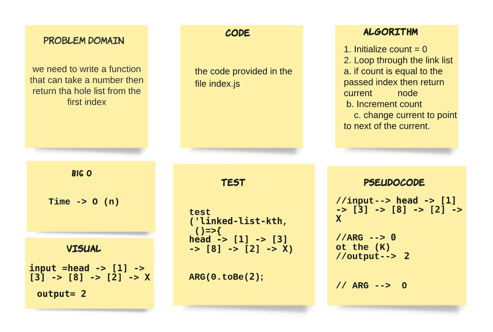
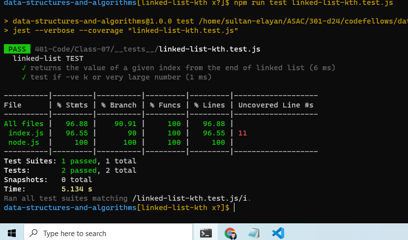

# linked-list-insertions

> we need to write a function that can take a number then return tha hole list from the first index  

## Whiteboard Process

## Approach & Efficiency
> - 1.5 hours  
- the time of looping 

