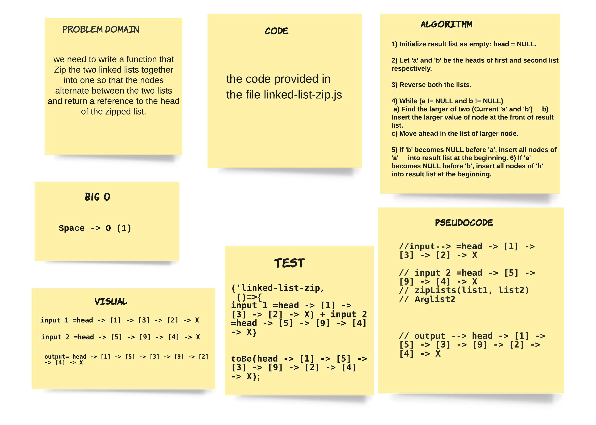
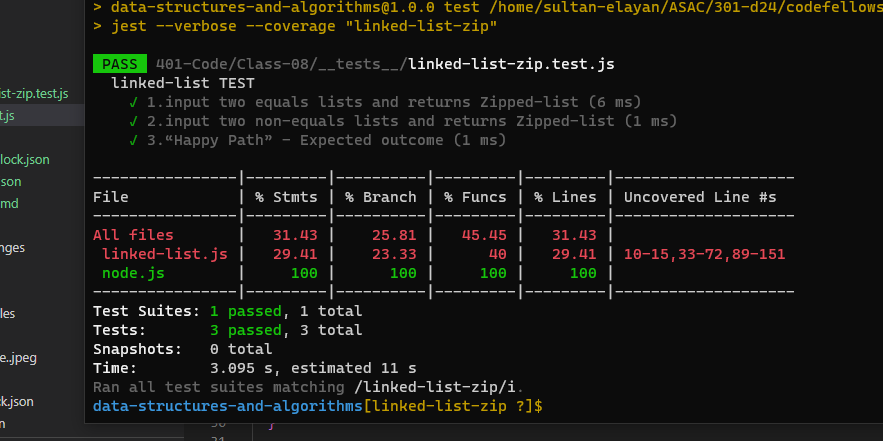

# linked-list-insertions

> we need to write a function that Zip the two linked lists together into one so that the nodes alternate between the two lists and return a reference to the head of the zipped list.  

## ACTION 

Repo Action Link -->> [Repo Action Link](https://github.com/sultan-elayan/data-structures-and-algorithms/actions)

## Whiteboard Process

## Approach & Efficiency
> - 1.5 hours  
- the space factor 

