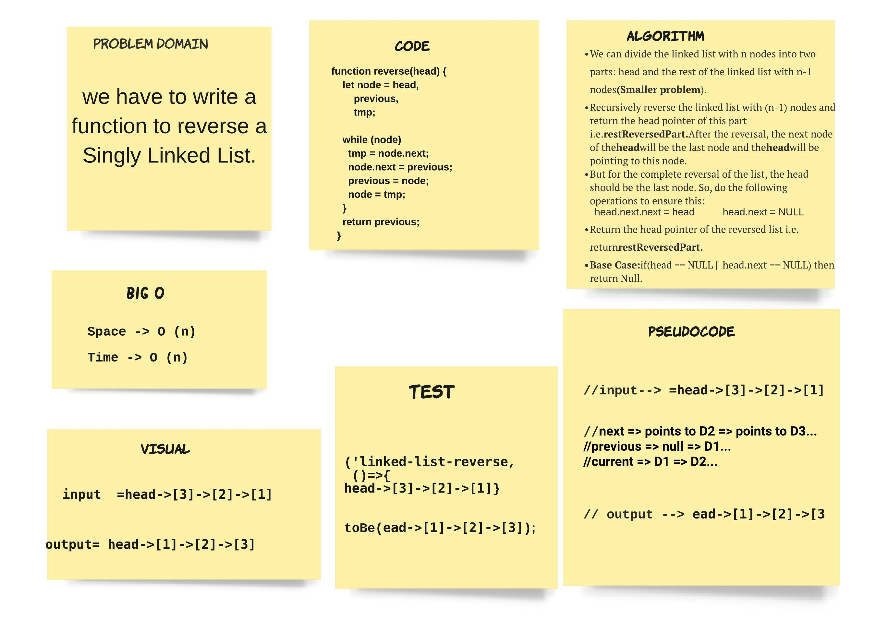

# Reverse a Linked List.

>  we have to write a function to reverse a Singly Linked List.

## ACTION 

Repo Action Link -->> [Repo Action Link](https://github.com/sultan-elayan/data-structures-and-algorithms/actions)

## Whiteboard Rubric

[Whiteboard Rubric](https://docs.google.com/spreadsheets/d/1_SoQcZrpaGlka97kyGej31NaXOhx3w_8PKXj_bTtoHA/edit?usp=sharing )

## Whiteboard Process

## Approach & Efficiency
> - 1.5 hours  
- the Space factor O(n) 
- the Time factor O(n) 

