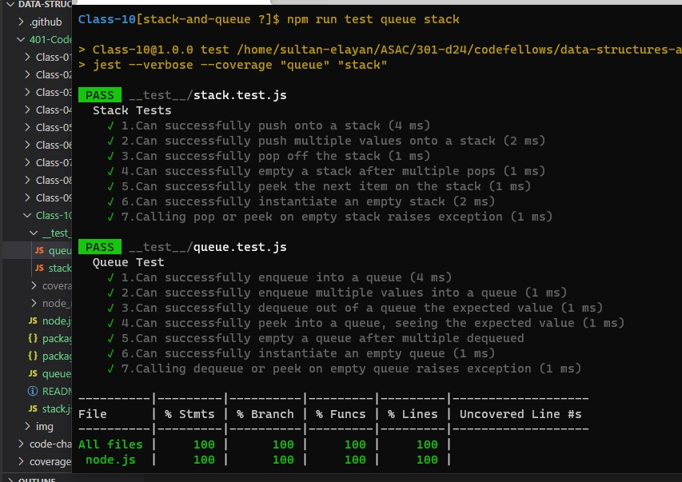

# stack-and-queue

>  Using a Linked List as the underlying data storage mechanism, implement both a Stack and a Queue

## ACTION 

Repo Action Link -->> [Repo Action Link](https://github.com/sultan-elayan/data-structures-and-algorithms/actions)

## Whiteboard Process

## Approach & Efficiency
> - 1 hours  
- the Space factor O(1) 
- the Time factor O(1) 

