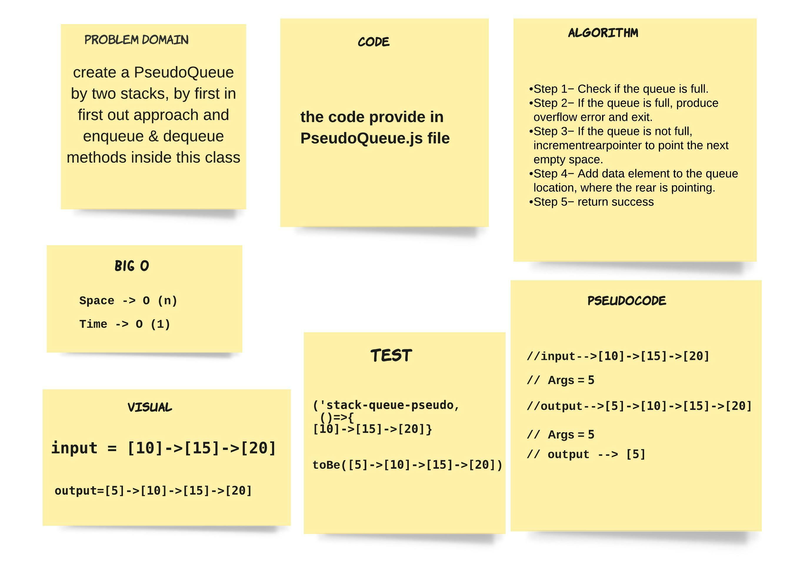
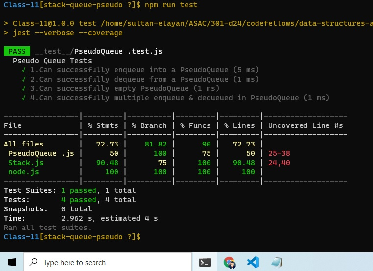

# stack-queue-pseudo

>  create a PseudoQueue by two stacks, by first in first out approach and enqueue & dequeue methods inside this class

## ACTION 

Repo Action Link -->> [Repo Action Link](https://github.com/sultan-elayan/data-structures-and-algorithms/actions)

## Whiteboard Process

## Approach & Efficiency
> - 1.5 hours  
- the Space factor O(n) 
- the Time factor O(1) 

