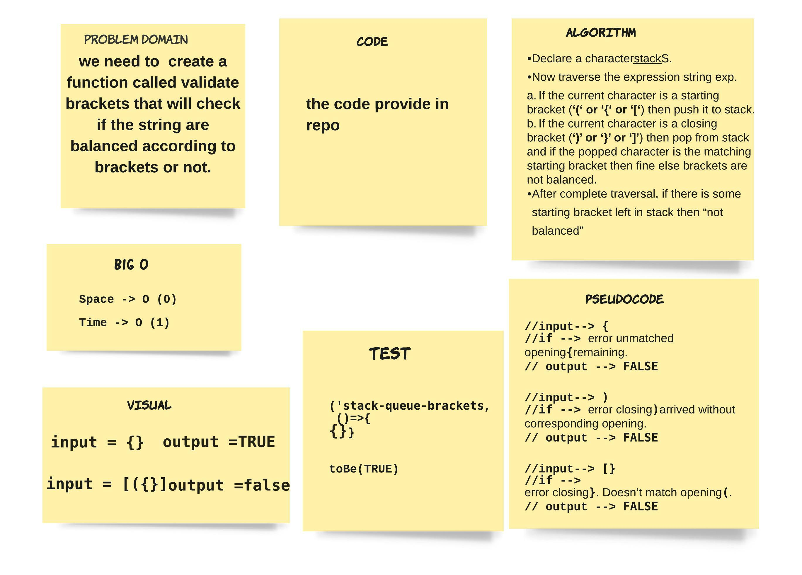
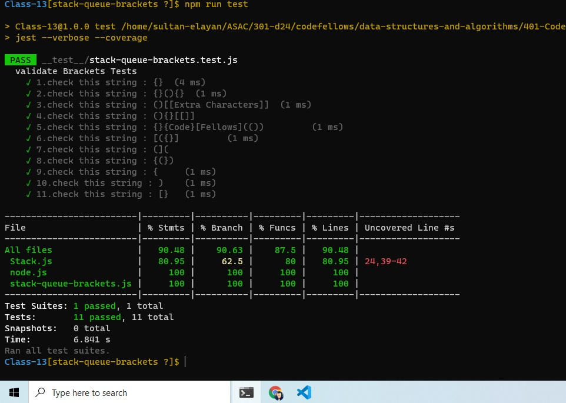

# stack-queue-brackets

> we need to create a function called validate brackets that will check if the string are balanced according to brackets or not.

## ACTION 

Repo Action Link -->> [Repo Action Link](https://github.com/sultan-elayan/data-structures-and-algorithms/actions)

## Whiteboard Process

## TEST 

## Approach & Efficiency
> - 1.5 hours  
- the Space factor O(n) 

