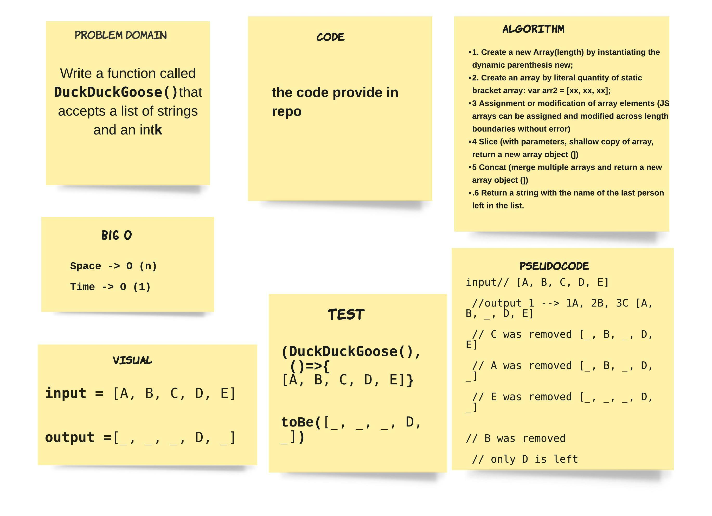
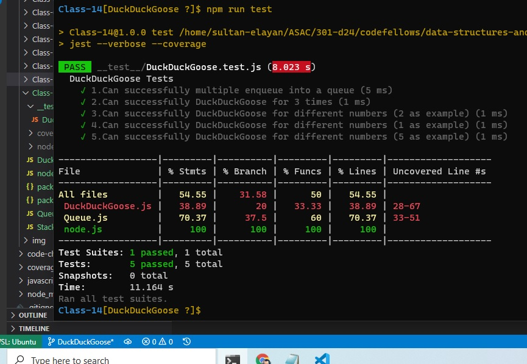

# DuckDuckGoose

> we need to create a Write a function called DuckDuckGoose()that accepts a list of strings and an intk

## ACTION 

Repo Action Link -->> [Repo Action Link](https://github.com/sultan-elayan/data-structures-and-algorithms/actions)

## Whiteboard Process

## TEST 

## Approach & Efficiency
> - 1.5 hours  

## BIG O 

- Space -> O (n)
- Time -> O (1)

