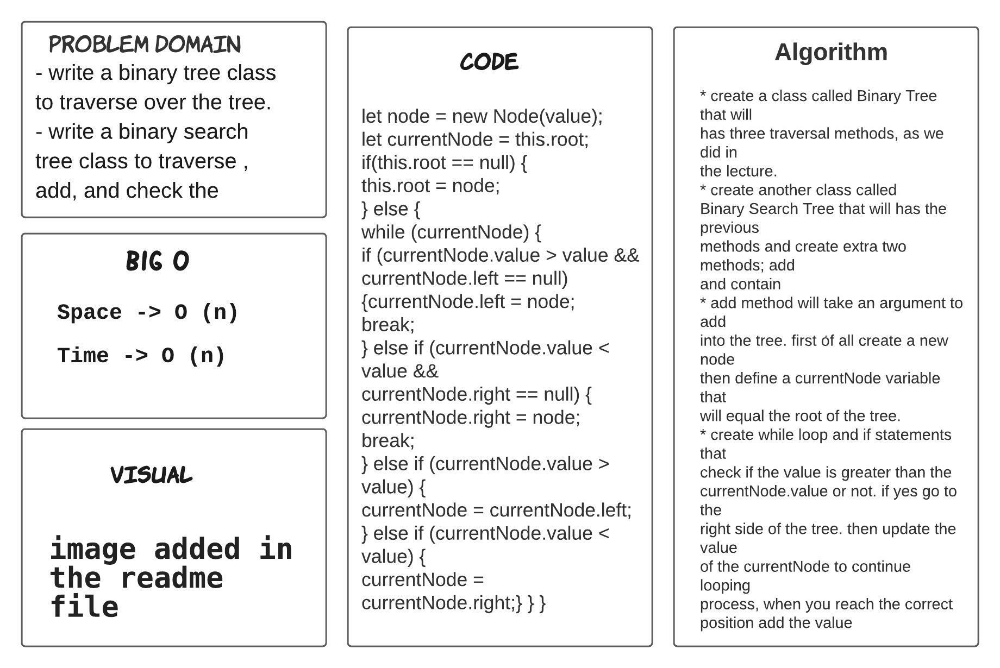
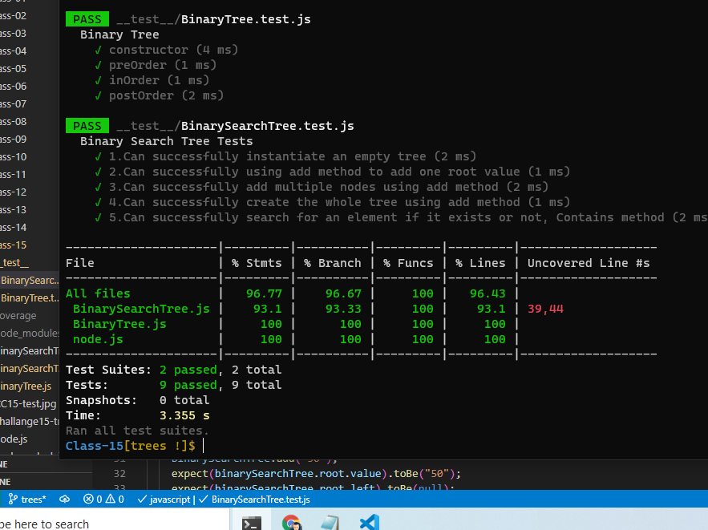
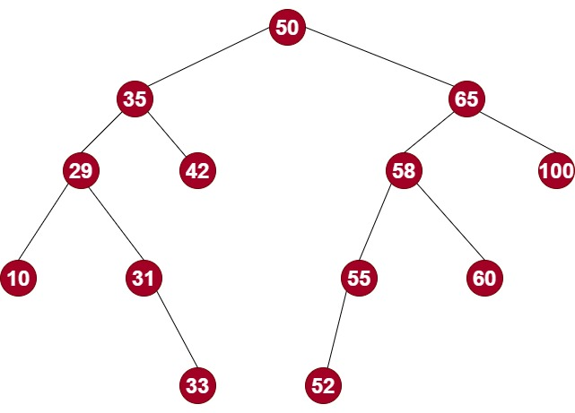
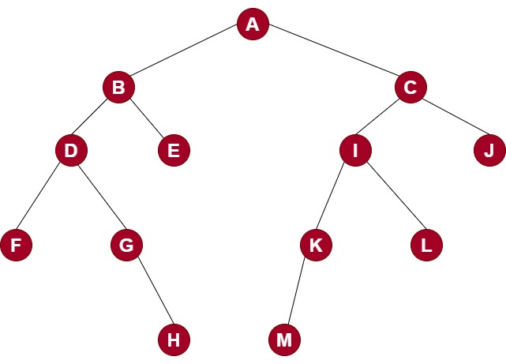

# Trees

> - write a binary tree class to traverse over the tree.
> - write a binary search tree class to traverse , add, and check the

## ACTION 

Repo Action Link -->> [Repo Action Link](https://github.com/sultan-elayan/data-structures-and-algorithms/actions)

## Whiteboard Process

## TEST 

## Visual

## Approach & Efficiency
> - 1.5 hours  

## BIG O 

- Space -> O (n)
- Time -> O (1)

