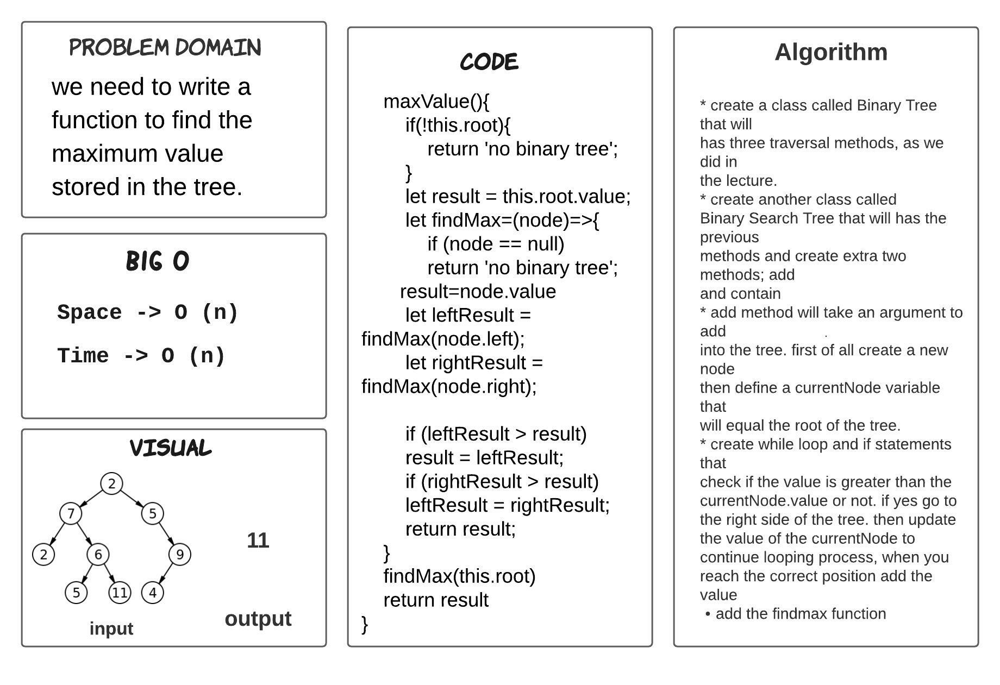
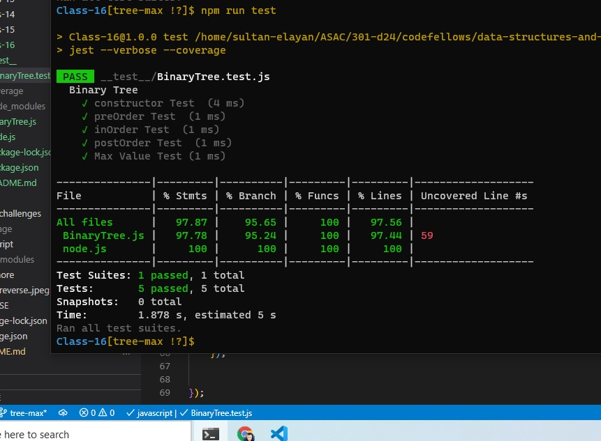

# tree-max

> - we need to write a function to find the maximum value stored in the tree. 

## ACTION 

Repo Action Link -->> [Repo Action Link](https://github.com/sultan-elayan/data-structures-and-algorithms/actions)

## Whiteboard Process

## TEST 

<!-- ## Visual

 -->

## Approach & Efficiency
> - 1.5 hours  

## BIG O 

- Space -> O (n)
- Time -> O (n)

