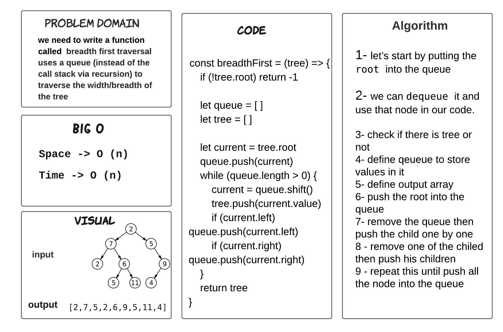
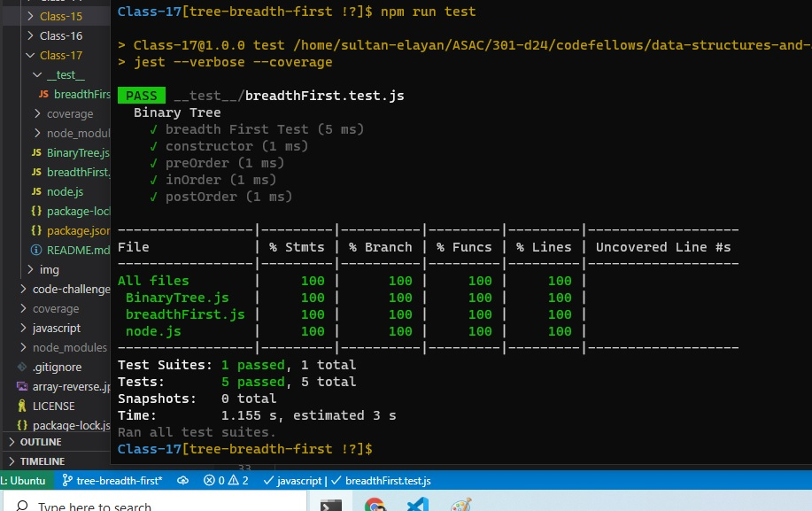

# tree-breadth-first

> - we need to write a function called  breadth first traversal uses a queue (instead of the call stack via recursion) to traverse the width/breadth of the tree

## ACTION 

Repo Action Link -->> [Repo Action Link](https://github.com/sultan-elayan/data-structures-and-algorithms/actions)

## Whiteboard Process

## TEST 

## Approach & Efficiency
> - 1.5 hours  

## BIG O 

- Space -> O (n)
- Time -> O (n)

