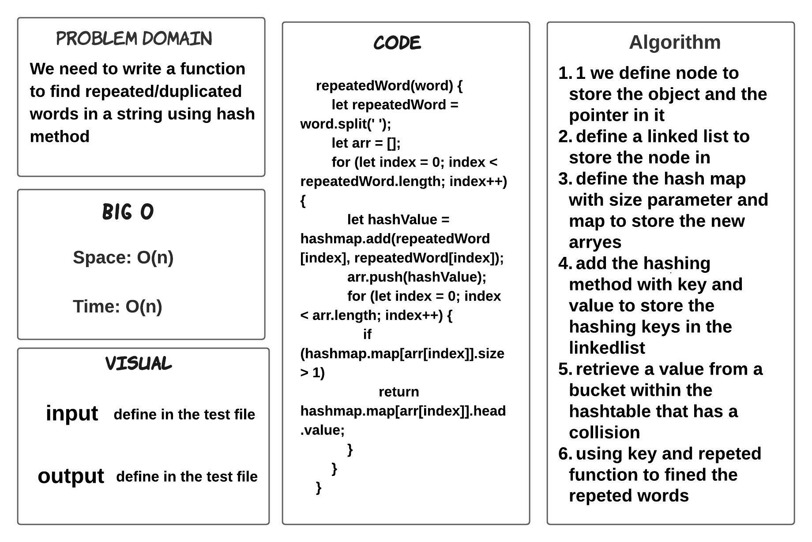
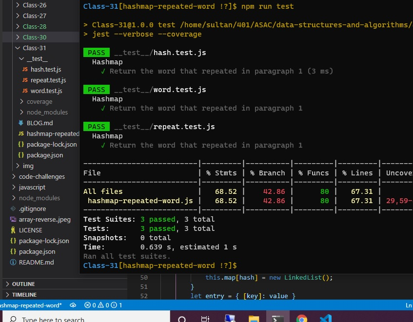

# hashmap-repeated-word

> ### We need to write a function to find repeated/duplicated words in a string using hash method 

## Whiteboard Process

## TEST

## Approach & Efficiency

> - 1.5 hours  

## BIG O 

- Space: O(n)

- Time: O(n)

