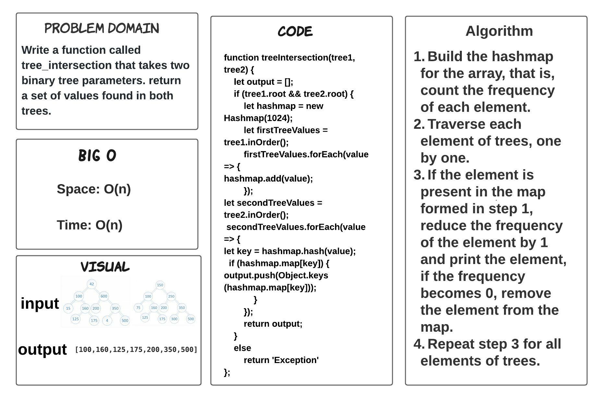
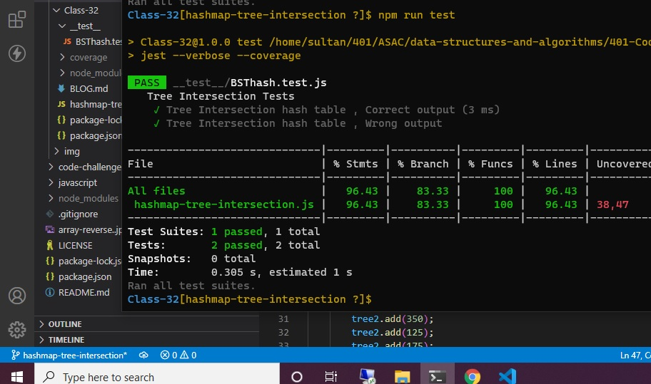

# hashmap-tree-intersection

> ### Write a function called tree_intersection that takes two binary tree parameters. and return a set of intersection values found in both trees.

## Whiteboard Process

## TEST

## Approach & Efficiency

> - 2 hours  

## BIG O 

- Space: O(n)

- Time: O(n)

