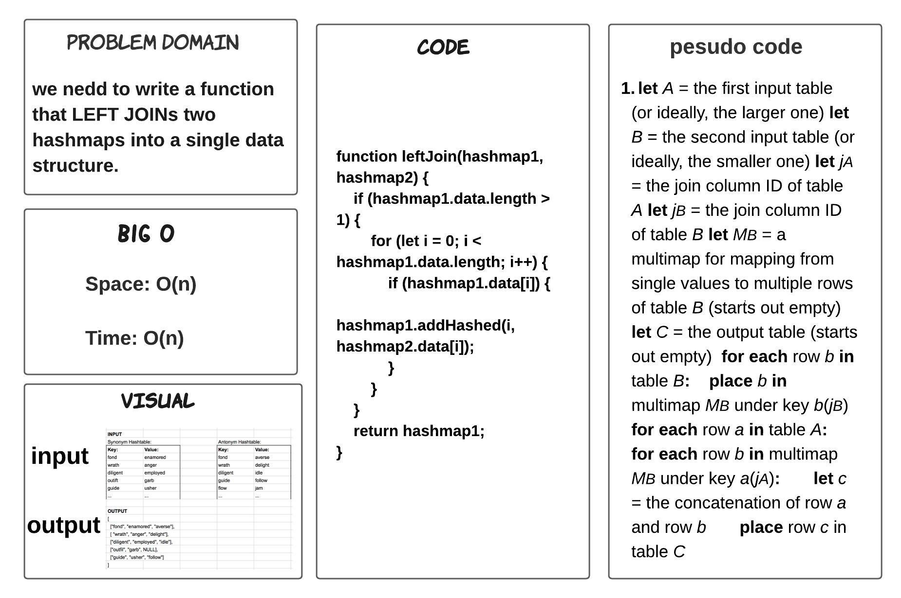
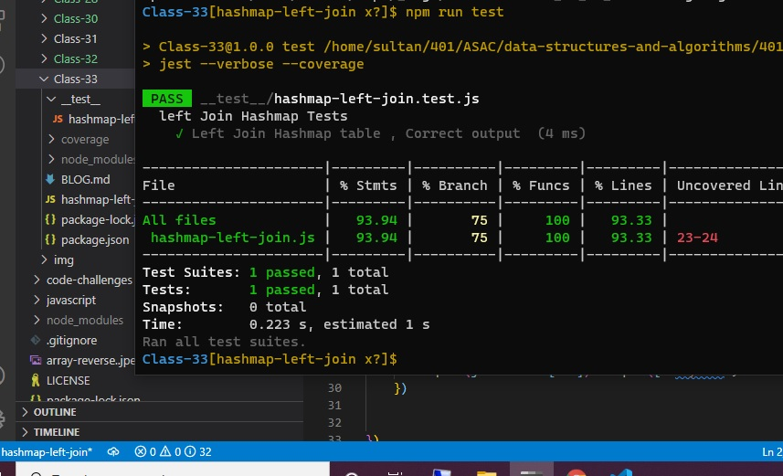

# hashmap-left-join

> ### we need to write a function that LEFT JOINs two hashmaps into a single data structure.

## Whiteboard Process

## TEST

## Approach & Efficiency

> - 2 hours  

## BIG O 

- Space: O(n)

- Time: O(m+n)

