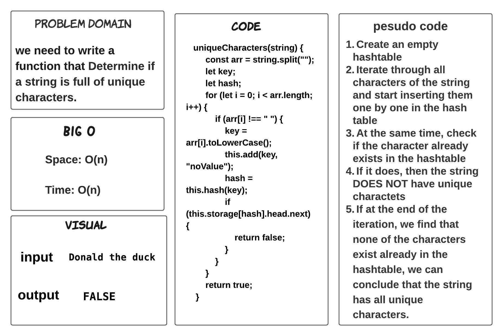
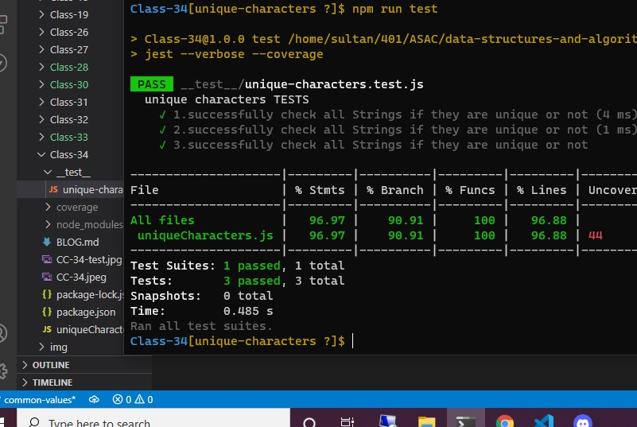

# Unique Characters

> ### we need to write a function that Determine if a string is full of unique characters.

## Whiteboard Process

## TEST

## Approach & Efficiency

> - 1 hours  

## BIG O 

- Space: O(n)

- Time: O(n)

