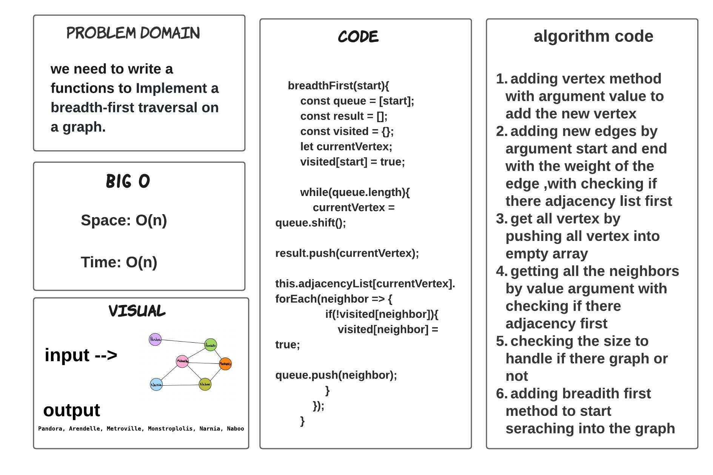
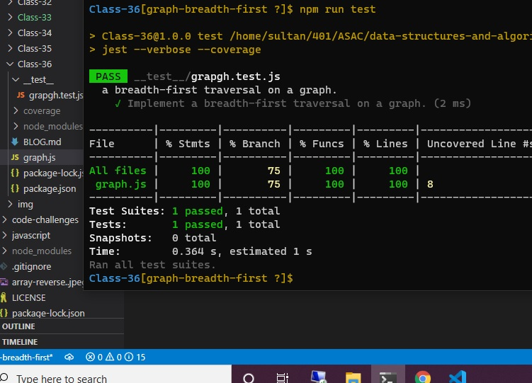

# graph-breadth-first

> ### we need to write a functions to Implement a breadth-first traversal on a graph.

## Whiteboard Process

## TEST

## Approach & Efficiency

> - 1 hours  

## BIG O 

- Space: O(n)

- Time: O(n)

