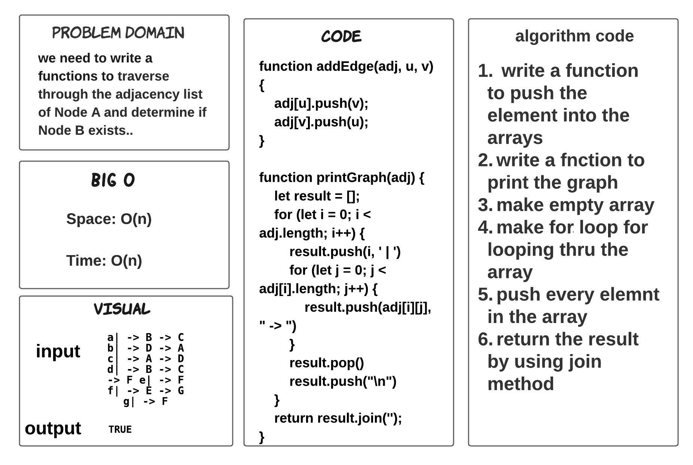
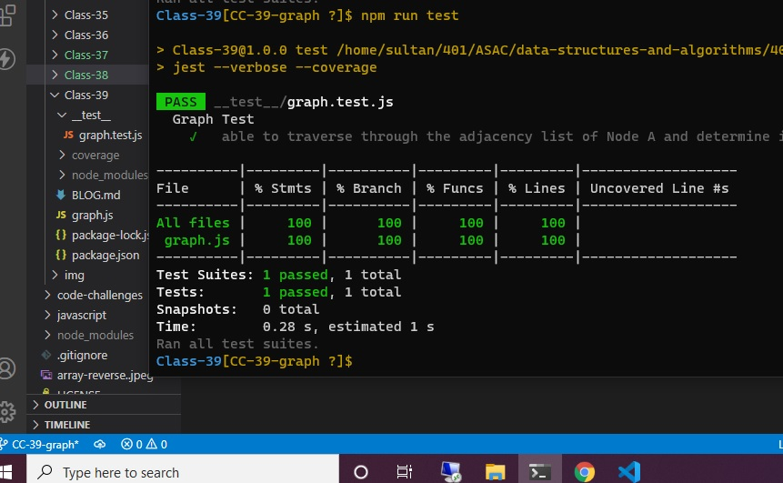

# graph "interview"

> ### we need to write a functions to traverse through the adjacency list of Node A and determine if Node B exists..

## Whiteboard Process

## TEST

## Approach & Efficiency

> - 1 hours  

## BIG O 

- Space: O(n)

- Time: O(n)

